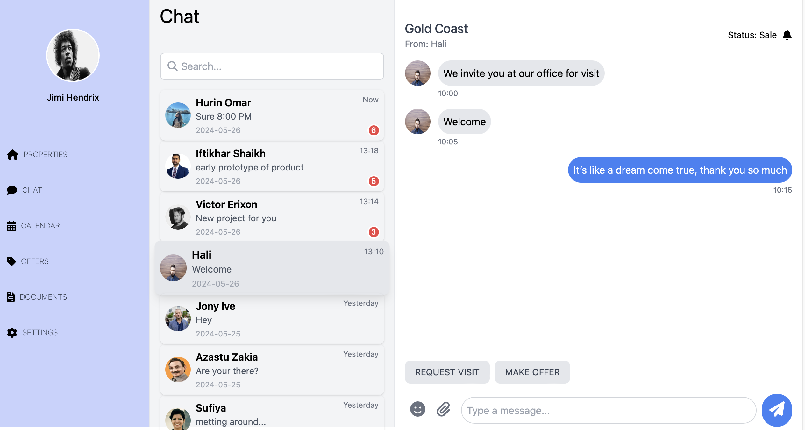
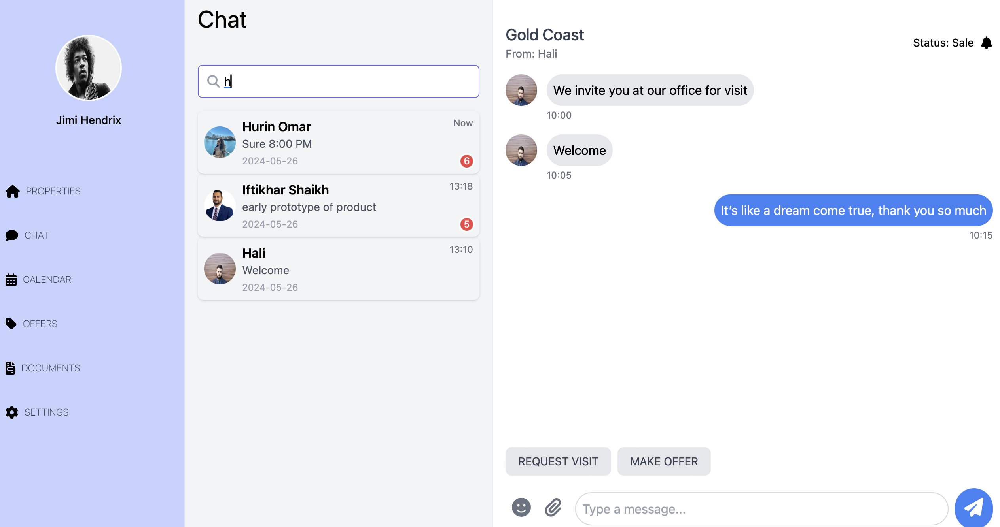

# Chat App UI

## Description

Internship tests: Write a frontend chat web application following the designWrite a frontend chat web application following the design.
## Features



### Built With

- [React](https://reactjs.org/docs/getting-started.html)
- [TypeScript](https://www.typescriptlang.org/docs/)
- [Tailwind CSS](https://tailwindcss.com/docs)


## Installation

1. Clone the project from GitHub:

    ```bash
   [https://github.com/Junkohoutarou/InternTest.git]
    ```

2. Navigate into the project directory:

    ```
    cd InternTest
    ```

3. Install the dependencies:


    ```
    npm install
    ```
    ```
    npm install @fortawesome/free-solid-svg-icons
    ```

4. Run the application:

    ```
    npm start
    ```

## Source Tree
📦src
 ┣── 📂Features                  
 ┃────┣──📂Chat
 ┃────┣──📂 ChatList
 ┃────┣──📂 ChatMessage 
 ┃────┣──📂 ChatWindow 
 ┃────┣──📂 Navigation 
 ┃────┗──📂 Profile
 ┣ 📜App.jsx                   
 ┣ 📜index.scss
 ┗ 📜main.jsx
 
## How to push

- Role commit
  `{type}: {subject}`
  - type: build | chore | ci | docs | feat | fix | perf | refactor | revert | style | test
  - subject: 'Write a short, imperative tense description of the change'
- Automatic: check lint and format pre-commit

- Example:

```bash
git commit -m "{type}: {subject}"
```

Description
|**Types**| **Description** |
|:---| :--- |
|feat| A new feature|
|fix| A bug fix|
|docs| Documentation only changes|
|style| Changes that do not affect the meaning of the code (white-space, formatting, missing semi-colons, etc) |
|refactor| A code change that neither fixes a bug nor adds a feature |
|perf| A code change that improves performance |
|test| Adding missing tests or correcting existing tests |
|build| Changes that affect the build system or external dependencies (example scopes: gulp, broccoli, npm) |
|ci| 'Changes to our CI configuration files and scripts (example scopes: Travis, Circle, BrowserStack, SauceLabs) |
|chore| Other changes that don't modify src or test files |
|revert| Reverts a previous commit |
